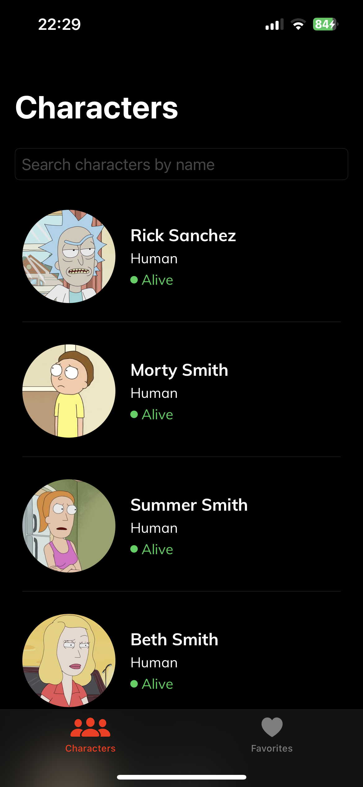
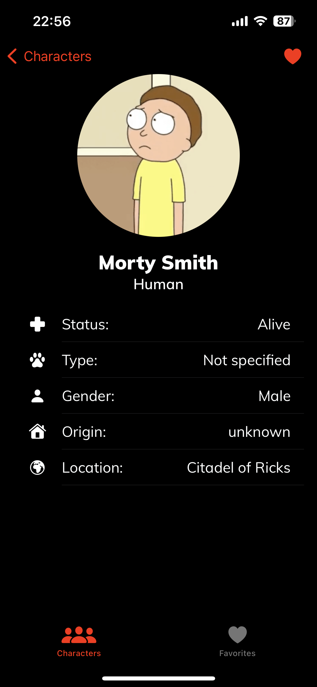
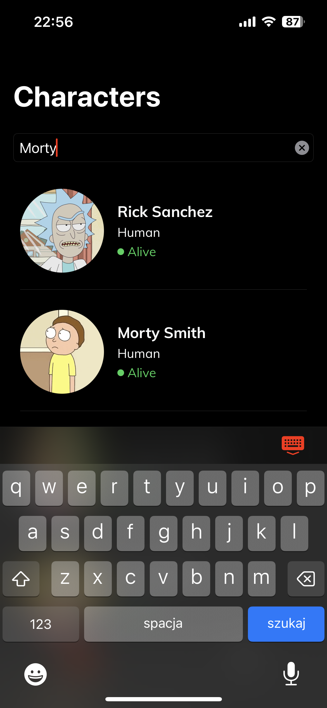
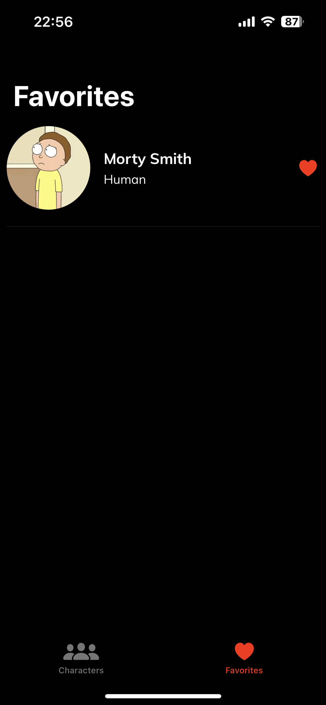
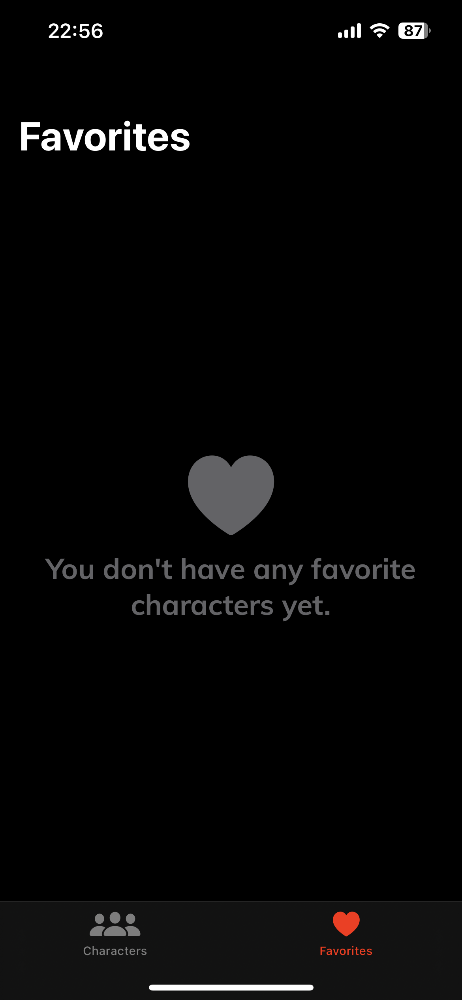

# Rick and Morty iOS App

### Technologies used:
1. Swift
2. SwiftUI
3. Swift Concurrency
4. RealmSDK
5. SFSymbols

### How to run this project:
1. Clone this repo
2. Open with Xcode 14+
3. Run on simulator or real device (highly recommended)

### Features:
1. Ability to browse characters from animated TV series 'Rick and Morty'.
2. Ability to search for particular characters.
3. Ability to like your favorite characters.
4. Ability to look at characters' detail information.

### Screenshots:

